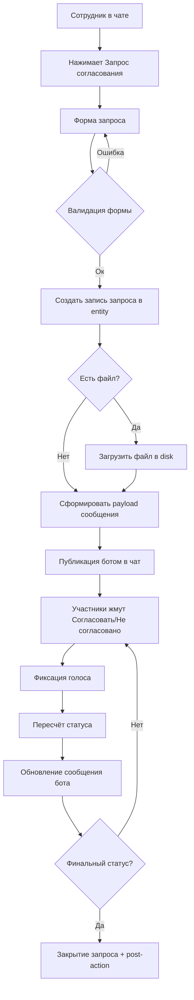
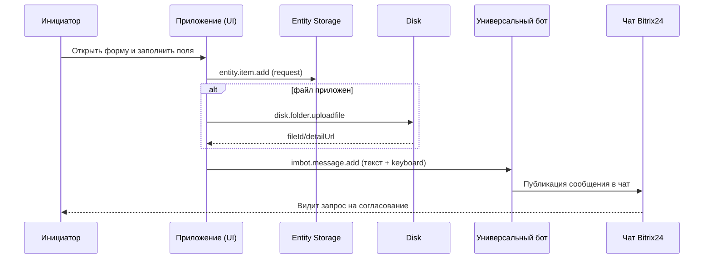
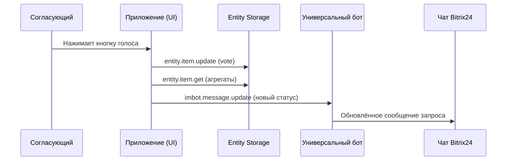
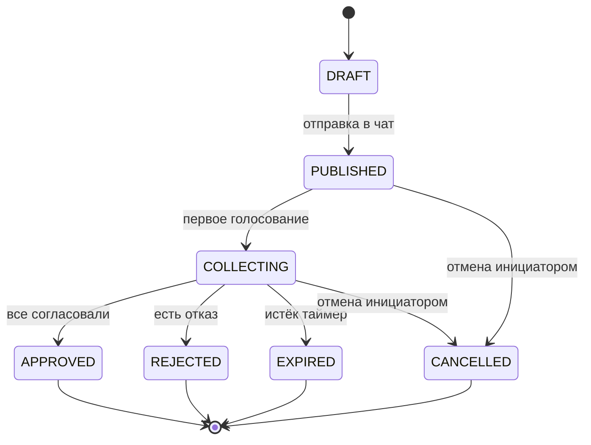

# Спецификация: Chat Approval App (Bitrix24)

## 1. Назначение

Приложение упрощает согласование в чатах Bitrix24 и убирает ручные сценарии вида "поставьте лайк, если согласны".

Целевой результат:
- инициатор создаёт структурированный запрос согласования;
- участники голосуют одной кнопкой;
- статус запроса прозрачен и обновляется в чате автоматически.

## 2. Контекст и ограничения

- Платформа: Bitrix24 чат (`IM_TEXTAREA`, contextual apps, бот-сообщения).
- UI: B24 UI Kit (`@bitrix24/b24ui-nuxt`).
- Цель: без выделенного backend приложения, где это возможно.
- Допущение MVP: универсальный бот уже зарегистрирован и доступен приложению.

## 3. Акторы

- `Инициатор`: сотрудник, создающий запрос.
- `Согласующий`: сотрудник, который голосует.
- `Универсальный бот`: публикует сообщение запроса и обновляет статусы.
- `Bitrix24 REST`: хранение данных и выполнение действий.

## 4. User Flow (высокий уровень)

## 5. Детальная логика

### 5.1 Создание запроса

1. Инициатор открывает форму из `IM_TEXTAREA`.
2. Вводит:
- комментарий (обязательный);
- список согласующих (обязательный, минимум 1);
- файл (опционально).
3. Приложение валидирует форму.
4. Создаётся запись запроса в `entity.item.add`.
5. При наличии файла — загрузка через `disk.folder.uploadfile`.
6. Приложение публикует сообщение от бота (`imbot.message.add`) с кнопками голосования.

### 5.2 Голосование

1. Согласующий нажимает `Согласовать` или `Не согласовано`.
2. Приложение получает контекст запроса (requestId, dialogId, messageId, vote).
3. Голос сохраняется/обновляется в хранилище.
4. Выполняется пересчёт агрегатов:
- totalApprovers
- approvedCount
- rejectedCount
- pendingCount
5. Бот обновляет сообщение (`imbot.message.update`) с актуальным статусом.

### 5.3 Завершение

Финальный статус:
- `APPROVED`: все обязательные согласующие нажали `Согласовать`.
- `REJECTED`: хотя бы один нажал `Не согласовано`.
- `EXPIRED`: вышел таймаут запроса (если включён).
- `CANCELLED`: инициатор отменил запрос.

## 6. Sequence Diagrams

### 6.1 Создание запроса

### 6.2 Голосование

## 7. State Model

## 8. Модель данных MVP

### 8.1 Request

- `id`
- `dialogId`
- `messageId`
- `initiatorId`
- `comment`
- `approverIds[]`
- `fileId` (nullable)
- `fileUrl` (nullable)
- `status`
- `createdAt`
- `updatedAt`
- `deadlineAt` (nullable)

### 8.2 Vote

- `id`
- `requestId`
- `userId`
- `decision` (`APPROVE` | `REJECT`)
- `comment` (nullable)
- `votedAt`

## 9. Бизнес-правила

- Инициатор не может голосовать за свой запрос (правило MVP, configurable).
- Повторный голос обновляет предыдущее решение пользователя.
- Запрос считается завершённым сразу при первом `REJECT`.
- Состав согласующих фиксируется на момент отправки запроса.
- Новые участники чата после публикации не входят в текущий кворум.

## 10. Обработка ошибок

- Ошибка публикации бота: запрос остаётся в `DRAFT`, показывается retry.
- Ошибка сохранения голоса: UI уведомляет и не меняет локальный статус.
- Ошибка загрузки файла: пользователь решает "повторить" или "отправить без файла".
- Ошибка обновления сообщения: ретрай с backoff; при фейле логируем техническую запись.

## 11. Интеграционные точки REST (первичный список)

- `placement.bind` (`IM_TEXTAREA`)
- `entity.add` / `entity.item.add` / `entity.item.update` / `entity.item.get`
- `disk.folder.uploadfile`
- `imbot.message.add`
- `imbot.message.update`
- `bizproc.workflow.start` (опционально, post-action)

## 12. CJM

| Этап | Действие пользователя | Мысль пользователя | Риск/боль | Решение в приложении |
|---|---|---|---|---|
| Триггер | Нужно быстро собрать согласование | "Не хочу вручную считать реакции" | Сообщения теряются | Быстрый запуск формы в чате |
| Подготовка | Заполняет комментарий, выбирает согласующих, файл | "Хочу отправить один раз и прозрачно" | Можно забыть важные поля | Валидация формы и обязательных данных |
| Публикация | Отправляет запрос | "Все должны видеть единый формат" | Нет структурированного шаблона | Единое бот-сообщение с кнопками |
| Голосование | Нажимает кнопку решения | "Отвечу одним кликом" | Лишний текст и шум в чате | Action-кнопки решения |
| Контроль | Смотрит текущий статус | "Кто уже ответил?" | Ручной подсчёт ответов | Автообновление статуса в сообщении |
| Завершение | Получает итог | "Нужен однозначный результат" | Неясно, закрыт ли вопрос | Финальный статус и post-action |

## 13. Out of Scope (MVP)

- Многоступенчатые маршруты согласования.
- Делегирование голоса.
- SLA-эскалации и напоминания.
- Аналитика в отдельном дашборде.

## 14. Открытые вопросы

1. Допускается ли голос инициатора в отдельных типах запросов?
2. Нужен ли обязательный комментарий при `REJECT`?
3. Нужно ли разрешать partial-approval (кворум N из M)?
4. Где хранить служебные лог-записи: только entity или отдельный слой?
5. Какой post-action при `APPROVED` обязателен в первом релизе?
